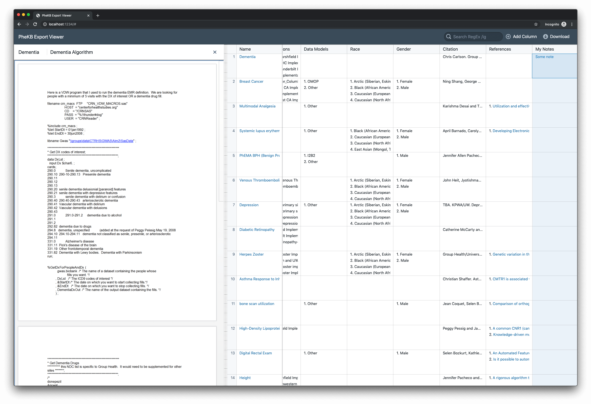

# PheKB ⬇️ Exporter & 🔬 Viewer

Utility that extracts PheKB phenotypes into a semi-structured JSON format, a
simple API that serves them up, and a UI that can be used to view them and make
notes.



## Requirements

1. NodeJS 10+

## Setup

1. Install dependencies

```sh
npm install -g yarn && yarn install
```

2. Setup Credentials

Create a file called `.env` in the workspace root that looks like:

```bash
PHEKB_USER=email@domain.com
PHEKB_PASS=s3cretp4ss
```

## Run

### Scraper

```sh
yarn run update-data
```

By default, this will only scrape the phenotypes with IDs that are listed in
[`phekb-phenotypes-calculated.json`](scraper/phekb-phenotypes-calculated.json). 
To crawl PheKB, set the `PHEKB_CRAWL` environment variable to `true`. This can
be done by adding to the `.env` file, or running:

```sh
PHEKB_CRAWL=true yarn run update-data
```

Crawling will try all the nodes on the Drupal site between `0` and `2000`. To
change the start and end point, set the `PHEKB_CRAWL_START` and
`PHEKB_CRAWL_END` environment variables:

```sh
PHEKB_CRAWL=true PHEKB_CRAWL_START=1990 PHEKB_CRAWL_END=2000 yarn run update-data
```

:bulb: This will delete your local data and generate a fresh copy by scraping
PheKB.

### Viewer

```
yarn run viewer
```

This will spin up the express api at http://localhost:3000/phenotype and serve
up the web app at http://localhost:1234.


## Usage

View the UI at http://localhost:1234.

Columns will be created containing phenotype data from PheKB. Click on files and
datasets to view them in a resizable side panel. Add columns for taking notes,
and right click on column headers to move them or delete them.

The <kbd>Download</kbd> button will export a CSV file containing your notes.

ℹ Data is saved in `localStorage`, so exporting isn't required unless you want
to share your notes.